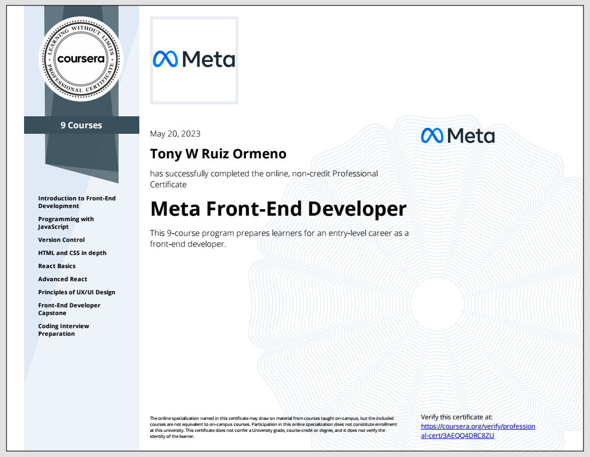

<strong>Curious, adaptable, and willing to learn.</strong>

## Experience

<strong>Social Network Platform</strong>

<I>Currently in development</I> 
 
 
<strong>Frontend:</strong> HTML5, CSS, JavaScript, jQuery  
<strong>Backend:</strong> VB.NET  
<strong>Database:</strong> SQL Server
 
<strong>Frameworks:</strong> ASP.NET Webforms

 

## Projects

<strong>Recent Project</strong>

   
  
Meta Capstone Project using <a href="https://react.dev/">React.js</a>

  

  <a href="https://github.com/tonyruizo-meta-coursera/capstone-little-lemon">View Code</a>

 

## Education

<strong>Degree</strong>

Computer Programming and Analysis A.S. @ <a href="https://www.hccfl.edu/academics/subjects/information-technology/computer-programming-and-analysis">HCC</a>.

  
<i>Present - Fall 2024</i>

<strong>Certifications</strong>

Meta Front-End Developer Certification - offered by <a href="https://www.coursera.org/professional-certificates/meta-front-end-developer#about">Meta staff</a>. 
  

  Click <a href="https://github.com/tonyruizo-meta-coursera">here</a> to view repos.

 

## How to reach me

Email @ <a href="mailto:tonyruizo@pm.me">tonyruizo@pm.me<a/>

Social Links: <a href="https://www.linkedin.com/in/tonyruizo/">Linkedin<a/>, <a href="https://twitter.com/tonyruizo">Twitter<a/> 

  
